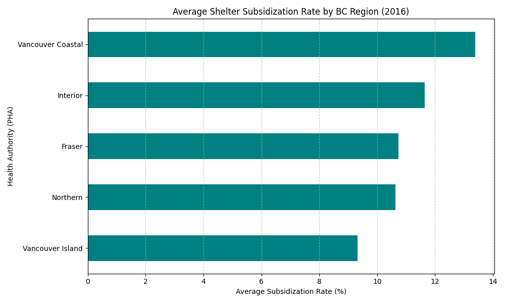

# Analyzing BC Housing Data with Python

### Description
This project analyzes the 2016 BC Housing Census data to investigate regional rent burdens and provincial subsidization rates.

The program demonstrates:
* **Data Ingestion:** Loading CSV datasets into DataFrames.
* **Boolean Masking:** Filtering rows based on high-rent criteria.
* **Statistical Aggregation:** Using `groupby` for regional averages.

### Code Overview
The project is structured around the following functions:
* `pd.read_csv()` – Loads the census data.
* `df[df['rate'] > 50]` – Filters for high-burden areas.
* `df.groupby('pha').mean()` – Calculates averages per Health Authority.

### Analysis Results
The screenshot of the generated plot is below:



### How to Run
1. Clone or download this repository.
2. Run the program:
   ```bash
   python project2_data_analysis.py

---

### License
This project is open-source and free to use for educational purposes.